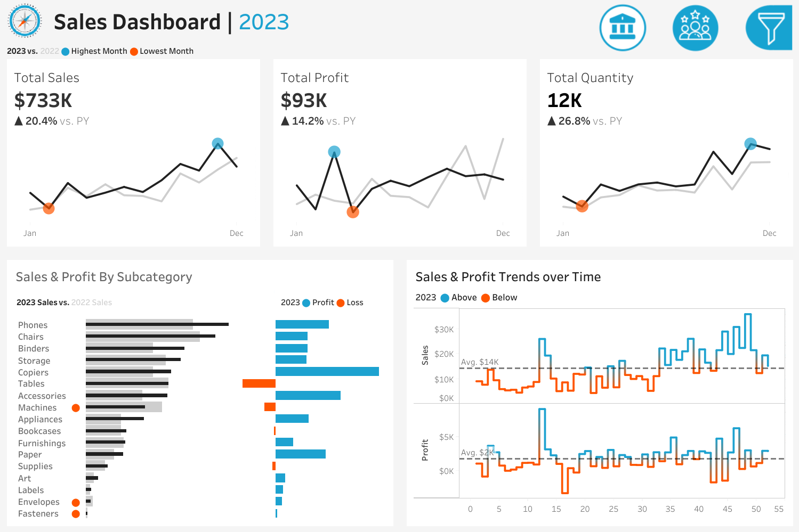
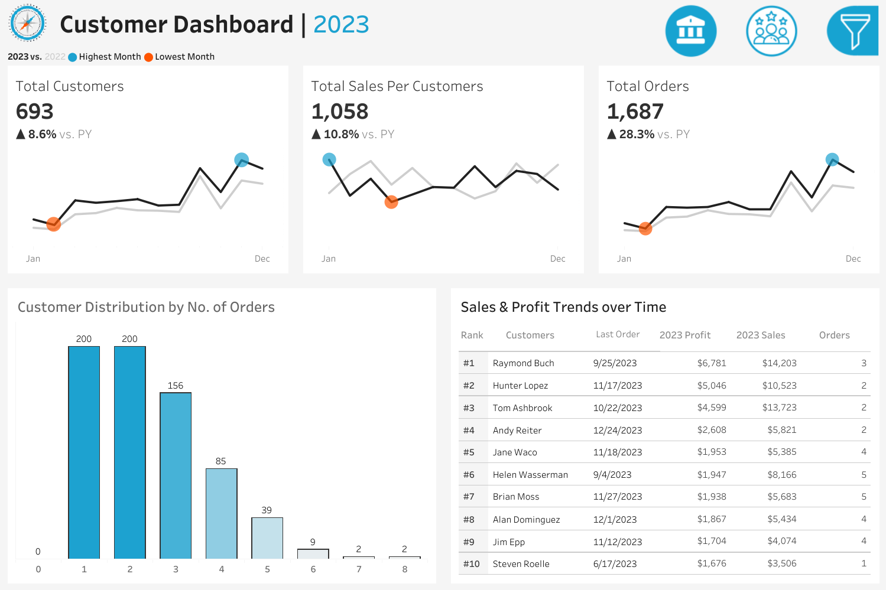

# Data Visualization - Sales Project

This project consists of two interactive dashboards designed to provide comprehensive data visualization and analysis. The first dashboard focuses on Sales Performance (Part 1), while the second centers on Customer Insights (Part 2).

Developed using Tableau, the dashboards are structured around detailed user stories that define key requirements and functionalities. The objective is to support stakeholders including sales managers and executives, in making informed, data-driven decisions by offering clear insights into both sales metrics and customer behavior.


*Image Credit: multiviewcorp.com*

# Sales Dashboard | Requirements | Part 1

## Dashboard Purpose

The purpose of sales dashboard is to present an overview of the sales metrics and trends in order to analyze year-over-year sales performance and understand sales trends.

## Key Requirements

### KPI Overview

Display a summary of total sales, profits and quantity for the current year and the previous year.

### Sales Trends

 - Present the data for each KPI on a monthly basis for both the current year and the previous year.
 - Identify months with highest and lowest sales and make them easy to recognize.

### Product Subcategory Comparision

 - Compare sales performance by different product subcategories for the current year and the previous year.
 - Include a comparison of sales with profit.

### Weekly Trends for Sales & Profit

 - Present weekly sales and profit data for the current year.
 - Display the average weekly values.
 - Highlight weeks that are above and below the average to draw attention to sales & profit performance.

# Customer Dashboard | Requirements | Part 2

## Dashboard Purpose

The customer dashboard aims to provide an overview of customer data, trends and behaviors. It will help marketing teams and management to understand customer segments and improve customer satisfaction.

## Key Requirements

### KPI Overview

Display a summary of total number of customers , total sales per customer and total number of orders for the current year and the previous year.

### Customer Trends

 - Present the data for each KPI on a monthly basis for both the current year and the previous year.
 - Identify months with highest and lowest sales and make them easy to recognize.

### Customer Distribution by Number of Orders

 - Represent the distribution of customers based on the number of orders they have placed to provide insights into customer behavior, loyalty and engagement.

### Top 10 Customers by Profit

 - Present the top 10 customers who have generated the highest profits for the company.
 - Show additional information like rank, number of orders, current sales, current profit and the last order date.

# Design & Interactivity Requirements

### Dashboard Dynamic

 - The Dashboard should allow users to check historical data by offering them the flexibility to select any desired year.
 - Provide users with the ability to navigate between the dashboards easily.
 - Make the charts and graphs interactive, enabling users to filter data using the charts.

### Data Filters

Allow users to filter data by product information like category and subcategory and by location information like region, state and city.

# Live Dashboards | Part 1 & Part 2

Check out the **Sales Dashboard (Part 1)** on Tableau Public using the link provided below:

## [Sales Dashboard Link](https://public.tableau.com/views/SalesCustomerDashboard_17445279355260/SalesDashboard)

Check out the screenshot of  **Sales Dashboard (Part 1)** below:


Check out the **Customer Dashboard (Part 2)** on Tableau Public using the link provided below:

## [Customer Dashboard Link](https://public.tableau.com/views/SalesCustomerDashboard_17445279355260/CustomerDashboard)

Check out the screenshot of  **Customer Dashboard (Part 2)** below:


## Repository Structure
```
Data-Visualization-Sales/
│
├── Dashboard Icons/                    # Icons used in the interactive dasboards for the project
│
├── Datasets/                           # Raw datasets used for the project
│
├── Images/                             # Dashboards Screenshots and Images
│   ├── data_visualization_image.png    # Image of data visualization
│   ├── sales_dashboard_image.png       # Static Screenshot of Sales Dashboard
│   └── customer_dashboard_image.png    # Static Screenshot of Customer Dashboard
│
└── README.md                           # Project overview and instructions
```

## Source of Inspiration

This project draws ideas, datasets or structures from the project featured on Youtube channel - Data with Baraa.
